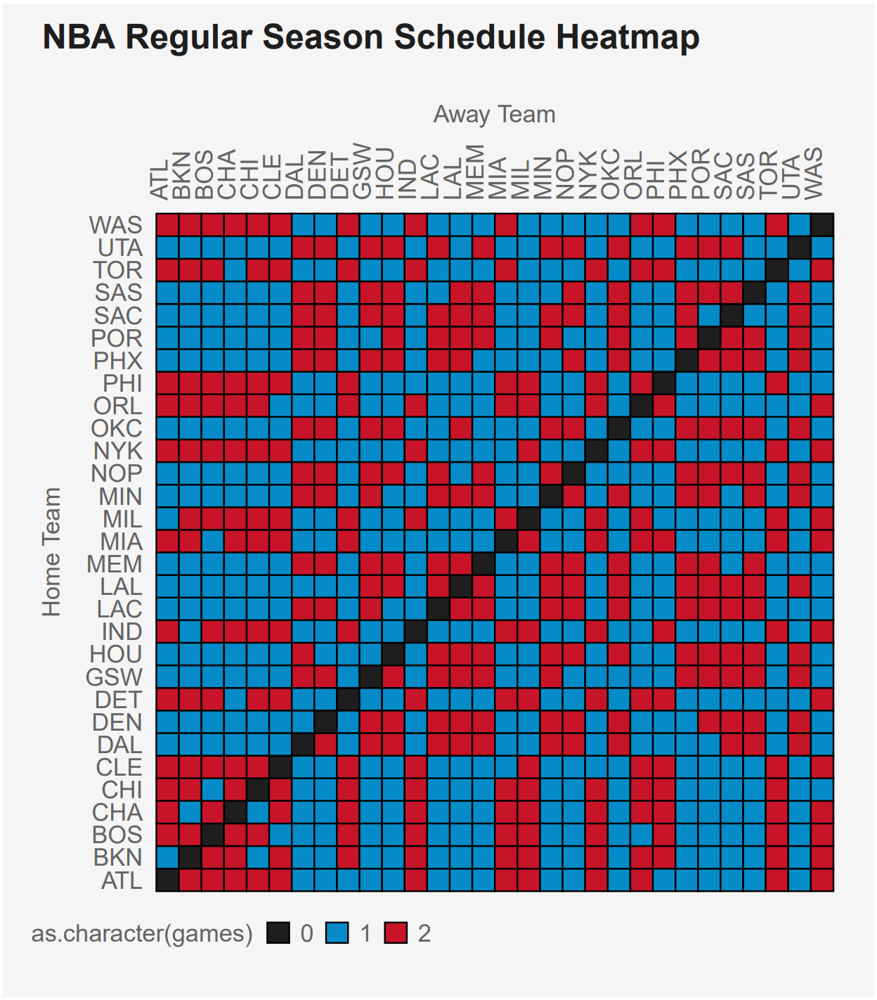
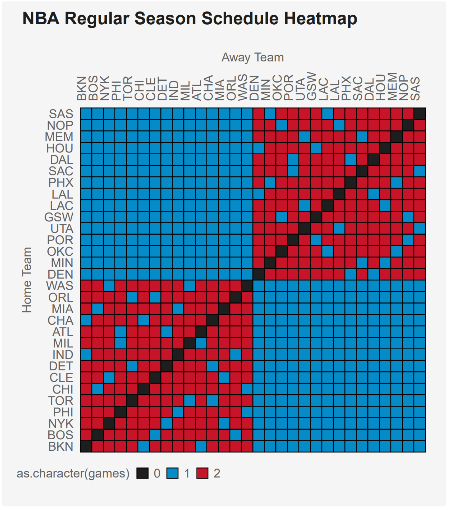
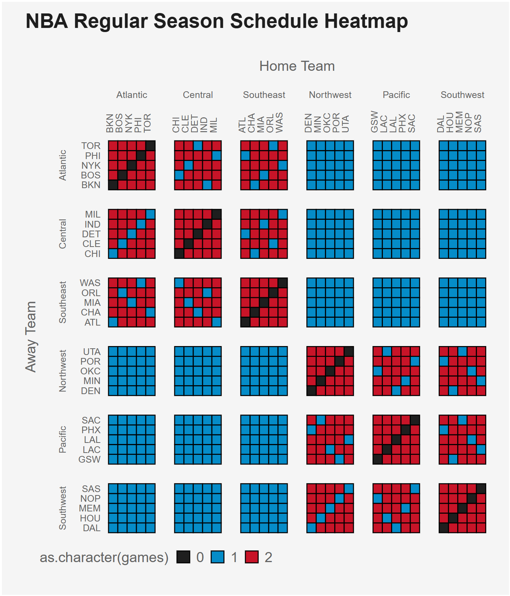

# Visualizations

Below is an array of various statistics visualizations created in the past as part of class assignments, projects. etc.

## Regular Season Schedule Heatmap

## Ordering the Teams by  Division

## Creating Separation between the Divisions

